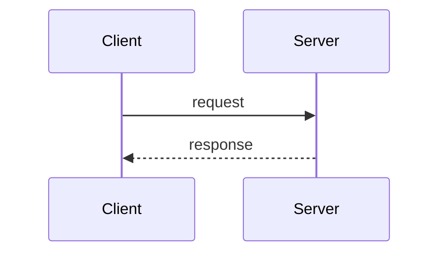

# 个人写作风格指南

本文档总结博客文章的写作风格规范，供创建新文章时参考。

## 文章结构

### 1. 开篇引入

- **系列文章**：使用编号标识系列文章（如 `Java Socket编程01 - 阻塞IO`）
- **背景介绍**：使用引用块（`>`）介绍文章背景或关联上下文
- **关联引用**：引用相关文章时使用 Markdown 链接

```markdown
# Java Socket编程01 - 阻塞IO

>本系列文章是响应式学习之旅的网络篇系列文章...
```

### 2. 正文组织

#### 层级标题

- 使用 `##` 表示主要章节
- 使用 `###` 表示子章节
- 保持标题层级清晰，避免跳级

#### 知识递进

遵循"基础概念 → 代码示例 → 问题分析 → 优化方案"的递进结构：

1. **概念介绍**：先介绍相关概念和背景
2. **简单示例**：给出最小可运行的代码示例
3. **问题分析**：指出当前方案的问题（使用引用块 `>` 标记关键问题）
4. **改进方案**：提供优化后的实现
5. **对比总结**：对比不同方案的优劣

```markdown
## 概念名称

概念解释和背景介绍...

## 示例代码

代码实现...

> 但是这个示例中有一个问题，**问题描述**。

我们可以对服务端进行如下改造...
```

### 3. 结尾总结

每篇文章以 `## 总结` 结尾，简要回顾文章内容：

- 总结核心知识点
- �告下一篇文章内容（如果是系列文章）
- 附上相关代码的 GitHub 链接

```markdown
## 总结

本篇文章介绍了...下一篇文章将介绍...相关代码见[GitHub - repo-name](link)。
```

## 代码规范

### 代码块格式

```markdown
```java
@Slf4j
public class Example {
    // implementation
}
```
```

- 始终指定语言类型（java, yaml, shell, mermaid 等）
- 使用 Lombok 注解简化代码（@Slf4j, @Getter, @RequiredArgsConstructor）
- 使用 try-with-resources 管理资源
- 添加适当的日志记录

### 代码组织

- **服务端示例**标记为 `* 服务端`
- **客户端示例**标记为 `* 客户端`
- **测试代码**包含完整的单元测试示例

### 测试用例

```java
@Test
void test() {
    // arrange
    int port = 6666;
    Server server = new Server(port);
    new Thread(server::start).start();

    // act
    Client client = new Client();
    String result = client.sendMessage("hello server", "localhost", port);

    // assert
    Assertions.assertEquals("expected", result);
}
```

## 可视化元素

### Mermaid 图表

使用 Mermaid 绘制流程图和时序图：

````markdown

````

常用图表类型：
- `sequenceDiagram` - 时序图
- `flowchart` / `graph` - 流程图
- `classDiagram` - 类图

### 图片引用

- 图片存放在 `./images/` 子目录
- 使用相对路径引用：``

## 文本格式

### 强调内容

- **粗体**：强调关键概念和问题点
- `行内代码`：类名、方法名、配置项使用反引号
- **引用块**：重要说明、问题提示使用 `>`

### 列表格式

- 使用 `*` 或 `-` 作为无序列表标记
- 列表项内容较长时保持适当的缩进

```markdown
* 项目1
  - 子项1.1
  - 子项1.2
* 项目2
```

## 外部引用

### 链接格式

```markdown
- 概念链接：[RSocket](https://rsocket.io/)
- 文章链接：[《文章标题》](relative-path.md)
- GitHub 链接：[GitHub - username/repo](https://github.com/...)
```

### 引用来源

引用课程、书籍、作者观点时：

```markdown
徐昊老师在《如何落地业务建模》课程中讲解过...
根据[GRASP](https://en.wikipedia.org/wiki/GRASP_)中信息专家模式...
```

## Frontmatter 模板

```yaml
---
icon: edit
date: YYYY-MM-DD
category:
  - 分类名称
tag:
  - tag1
  - tag2
---
```

## 文章类别

当前博客的主要技术文章类别：

- **RSocket**：RSocket 协议相关
- **DDD**：领域驱动设计
- **响应式编程**：Reactor、RxJava 等

新建文章时选择合适的分类，必要时可在 `src/.vuepress/sidebar/` 中更新配置。
