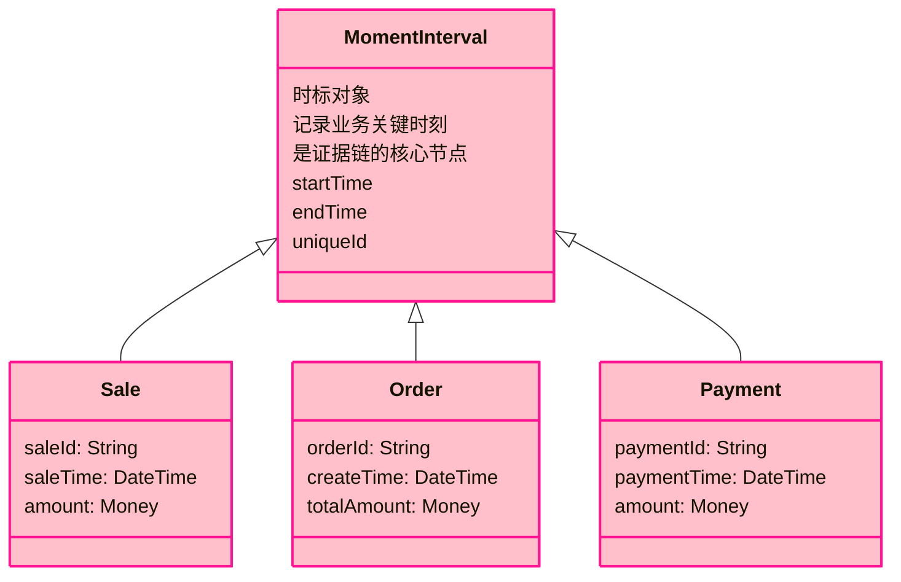
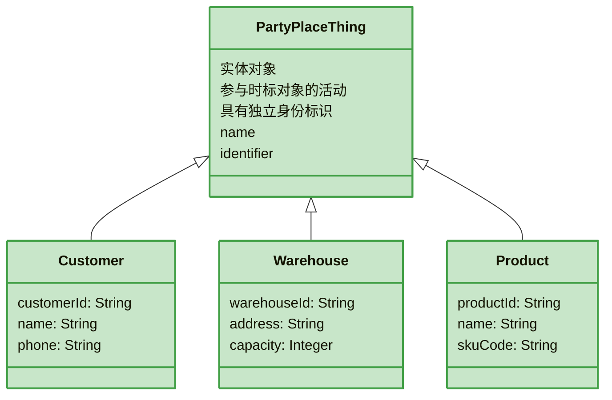
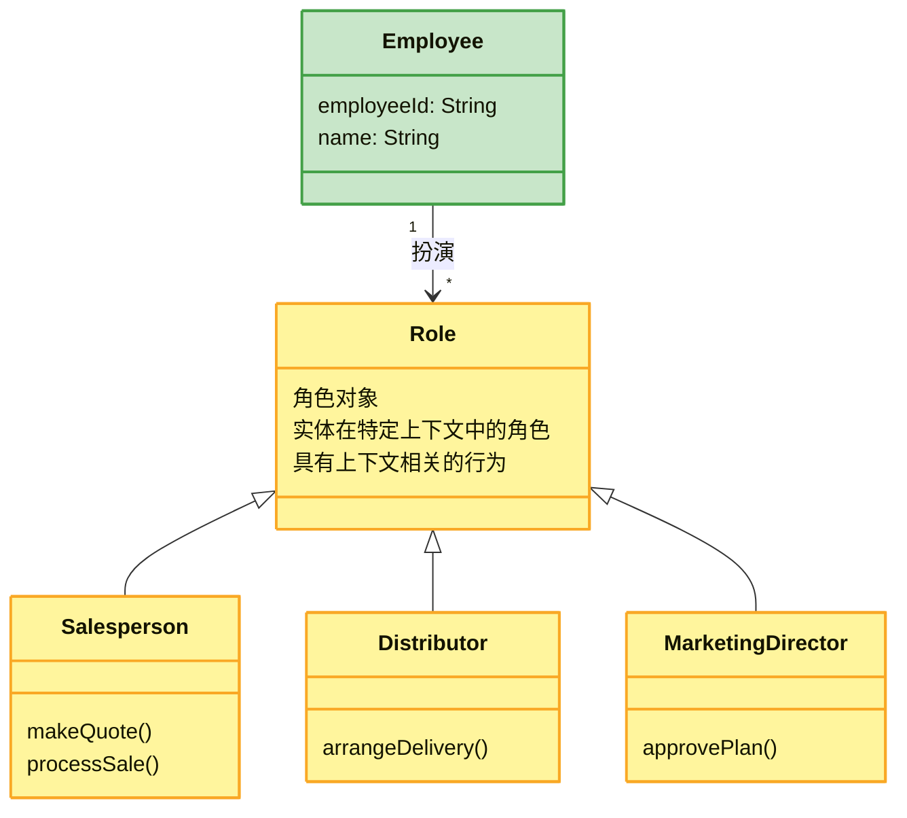
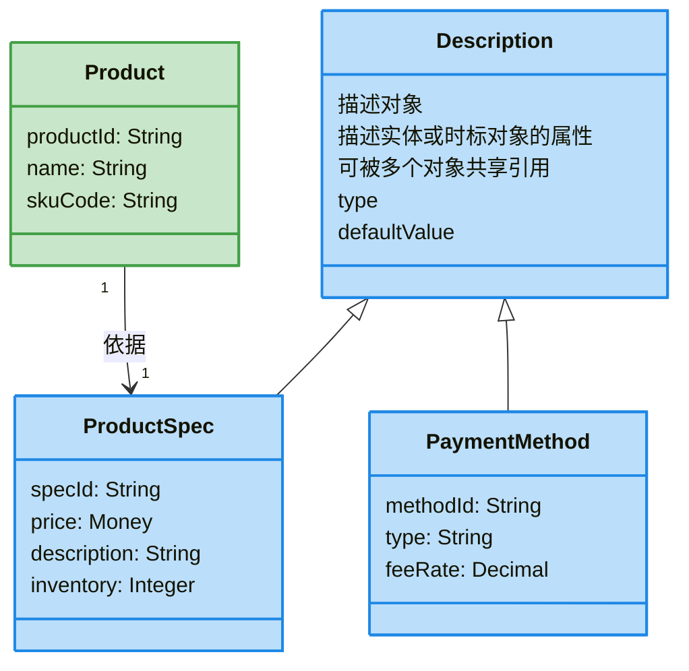
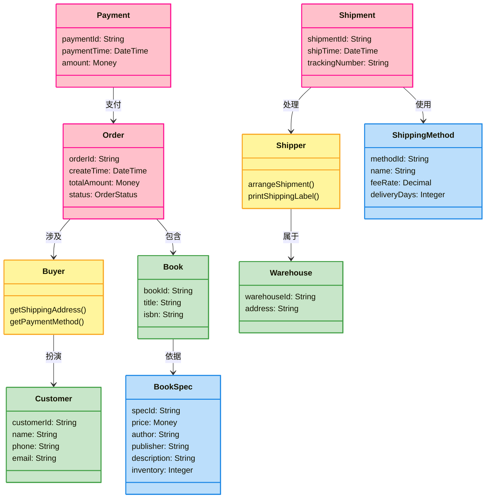

# 四色建模：从证据链视角理解业务建模

> 在 [四色建模法 - DDD 建模的实用方法论](./four-color-modeling.md) 一文中，我们介绍了四色建模的基本概念和四种原型的定义。本文将从另一个角度——**业务证据链**——来理解四色建模的本质，帮助你更好地掌握这一建模方法。

## 为什么需要证据链？

让我们从一个典型的业务场景开始：

> 假设你是一家在线书店的 COO，一天有客户投诉说购买的书籍少了一本，且价格计算有误，多付了钱。在做出赔偿承诺前，你需要验证客户说的是否属实。你需要什么信息来做出准确判断？

要解决这个问题，你需要：
1. 查看**订单表单**——客户订购了哪些书、应付金额
2. 查看**银行交易记录**——客户实际支付了多少钱
3. 查看**快递运单**——书店实际发出了哪些书
4. 查看**包裹详情**——包裹里具体包含了哪些书籍
5. 查看**促销计划**——促销活动何时开始

这个案例揭示了一个核心事实：**任何业务事件都会以某种数据形式留下痕迹**。我们无法回到过去亲眼看到发生了什么，但通过查看这些"痕迹"，我们可以推断出某段时间内发生了什么。

```mermaid
flowchart LR
    A[客户投诉] --> B[查看订单]
    B --> C[查看支付记录]
    C --> D[查看运单]
    D --> E[查看包裹详情]
    E --> F[查看促销计划]
    F --> G[得出结论]

    classDef PinkStyle fill:#ffc0cb,stroke:#ff1493,stroke-width:2px
    class OrderA:::PinkStyle
    class PaymentA:::PinkStyle
    class ShipmentA:::PinkStyle
```

## 证据链的本质

### 数据的双重价值

上述案例中涉及的数据具有两个关键特征：

**1. 法律责任的基础**
订单表单、运单等单据是企业法律责任的依据。如果客户下单错误，而运单显示书店发出了正确数量的商品，那么书店就不承担过失责任。

**2. 业务流程的执行结果**
包裹详情、配送记录等数据是关键业务流程的执行结果。通过这些数据，我们可以在不了解流程细节的情况下，追踪和分析紧急事件。

### 业务系统的核心目的

从管理者和运营者的角度来看，企业业务系统需要回答两个根本问题：

1. **如果我支付了一笔钱，我有什么权利？**
2. **如果我收到了一笔钱，我有什么义务？**

> 这两个问题的答案只能由业务系统捕获的相应**证据**来提供。因此，企业业务系统的一个主要目的就是记录这些痕迹，并用它们形成有效的**可追溯证据链**。

## 四色建模与证据链

### 时标对象：证据链的核心

那些可以构成证据链的数据有一个共同特征：**它们都是时标对象（Moment-Interval）**——代表某个时刻或时间段的对象。

**核心判断问题：** 这个对象是否代表我们需要记住和处理的某个时刻或时间段，出于法律或业务原因？

时标对象的示例：
* `Sale`（销售）——销售发生时刻
* `Order`（订单）——订单创建时刻
* `Rental`（租赁）——租赁时间段
* `Employment`（雇佣）——雇佣时间段
* `Journey`（行程）——行程时间段



> **时标对象构成了整个领域模型的骨干**。围绕时标对象，我们可以逐步识别其他类型的领域对象。

### 实体对象：证据的参与者

在时标对象中操作或被操作的对象，或时标对象发生的地点，就是**实体对象（Party/Place/Thing）**。

三种实体类型：
* **Party（参与方）**：人、组织，如客户、员工、供应商
* **Place（地点）**：仓库、零售店铺、配送地址
* **Thing（物品）**：产品、配件、商品



### 角色对象：实体的参与方式

当一种实体在不同流程中可以扮演不同角色时，需要提取**角色对象（Role）**。

**示例**：`Employee` 实体在不同场景下：
* 在销售场景中可以是 `Salesperson`（销售员）
* 在配送场景中可以是 `Distributor`（分销商）
* 在管理场景中可以是 `MarketingDirector`（市场总监）



> **角色对象的价值**：一个绿色实体可以在不同上下文中扮演多个黄色角色。通过角色对象，我们可以将上下文相关的行为从实体中分离出来，使实体保持简洁。

### 描述对象：规格的复用

将实体的详细描述信息放入**描述对象（Description）**，实现描述的复用。

**示例**：`Book` 对象可能只包含基本信息（标题、ISBN），而其他描述性信息（作者、摘要、目录）可以放在 `BookDescription` 对象中。



## 证据链驱动的建模步骤

从证据链视角，四色建模法的步骤更加清晰：

### Step 1: 识别需要追踪的事件

根据管理和运营需求，识别哪些事件需要被追踪：

> "书店需要支持客户查询订单状态、处理退货请求、分析销售趋势"

从这段需求中，我们可以识别出需要追踪的事件：
* 订单创建
* 支付完成
* 商品发货
* 退货处理

### Step 2: 识别时标对象

将需要追踪的事件转化为时标对象：

* `Order`（订单）——记录订单创建时刻的信息
* `Payment`（支付）——记录支付完成时刻的信息
* `Shipment`（发货）——记录发货时刻的信息
* `Return`（退货）——记录退货处理的信息

> **时标对象是整个领域模型的骨干**。围绕时标对象，我们可以逐步识别其他类型的领域对象。

### Step 3: 识别实体对象

识别与时标对象相关的实体：

* `Customer`（客户）
* `Book`（图书）
* `Warehouse`（仓库）
* `Courier`（快递员）

### Step 4: 识别角色对象

对于可以扮演不同角色的实体，提取角色对象：

* `Buyer`（买家）——`Customer` 在订单中的角色
* `Returner`（退货人）——`Customer` 在退货中的角色
* `Shipper`（发货人）——`Warehouse` 在发货中的角色

### Step 5: 识别描述对象

用描述对象补充实体信息：

* `BookSpec`（图书规格）——描述图书的详细信息
* `ShippingMethod`（配送方式）——描述配送的规则和费用

## 完整建模示例：书店订单系统

结合以上步骤，我们来看一个完整的书店订单系统的四色建模：



## 代码实现

基于上述模型，我们可以用代码表达：

```java
// * 粉色类 - 时标对象
@Slf4j
@Getter
public class Order {
    private final OrderId orderId;
    private final LocalDateTime createTime;
    private Money totalAmount;
    private OrderStatus status;

    // 关联角色
    private final Buyer buyer;
    private final List<OrderItem> items;

    public Order(OrderId orderId, Buyer buyer, List<OrderItem> items) {
        this.orderId = orderId;
        this.createTime = LocalDateTime.now();
        this.buyer = buyer;
        this.items = items;
        this.status = OrderStatus.PENDING;
        this.totalAmount = calculateTotalAmount();
    }

    private Money calculateTotalAmount() {
        return items.stream()
            .map(OrderItem::getSubTotal)
            .reduce(Money.ZERO, Money::add);
    }

    public void completePayment(Payment payment) {
        this.status = OrderStatus.PAID;
        log.info("订单 {} 支付完成，金额：{}", orderId, payment.getAmount());
    }
}

// * 黄色类 - 角色
public interface Buyer {
    Address getShippingAddress();
    PaymentMethod getPaymentMethod();
}

public interface Shipper {
    void arrangeShipment(Shipment shipment);
    ShippingLabel printShippingLabel(Shipment shipment);
}

// * 绿色类 - 实体对象
@Getter
public class Customer implements Buyer {
    private final CustomerId customerId;
    private String name;
    private String phone;
    private String email;
    private Address defaultAddress;
    private PaymentMethod defaultPaymentMethod;

    @Override
    public Address getShippingAddress() {
        return this.defaultAddress;
    }

    @Override
    public PaymentMethod getPaymentMethod() {
        return this.defaultPaymentMethod;
    }
}

// * 蓝色类 - 描述对象
@Getter
public class BookSpec {
    private final SpecId specId;
    private Money price;
    private String author;
    private String publisher;
    private String description;
    private Integer inventory;

    public boolean isAvailable(Integer quantity) {
        return this.inventory >= quantity;
    }

    public void decreaseInventory(Integer quantity) {
        if (!isAvailable(quantity)) {
            throw new IllegalStateException("库存不足");
        }
        this.inventory -= quantity;
    }
}
```

## 颜色建模的价值

### 1. 视觉化的模型理解

四种颜色为领域模型提供了**额外的视觉维度**：

* 从远处观察模型时，可以快速识别重要方面
* 容易发现需要审查的区域（如颜色类别的异常组合）
* 对建模新手特别有帮助

### 2. 模式识别的天然支持

彩色对象吸引人脑的模式识别部分：

* 首先寻找"粉色"对象——快速识别时标对象
* 然后分析"绿色"对象——识别参与实体
* 接着定义"黄色"对象——明确角色关系
* 最后提取"蓝色"对象——复用描述信息

### 3. 支持业务运营的证据链

最重要的是，四色建模法确保我们的模型能够：

* **记录业务事件的痕迹**——时标对象作为证据链节点
* **追踪法律责任**——基于时标对象的法律责任基础
* **支持业务运营**——通过证据链回答权利和义务问题

## 与 DDD 战略设计的映射

四色建模法与 DDD 的战略设计有天然的对应关系：

| 四色建模 | DDD 概念 | 说明 |
|---------|---------|------|
| 粉色类 | 聚合根、领域事件 | 业务事件的载体，证据链的核心 |
| 黄色类 | 受限上下文中的角色 | 上下文相关的行为和权限 |
| 绿色类 | 实体 | 跨越上下文持久存在的对象 |
| 蓝色类 | 值对象、规格模式 | 可复用的描述和规则 |

> 徐昊老师在《如何落地业务建模》课程中指出，四色建模法是连接业务需求和代码实现的有效桥梁。通过时标对象构建证据链，我们可以确保领域模型真正支持业务运营。

## 实践建议

### 建模顺序

建议按照 **粉色 → 绿色 → 黄色 → 蓝色** 的顺序进行建模：

1. **首先**，根据管理和运营需求识别需要追踪的事件
2. **其次**，识别可以代表需要追踪的事件的痕迹和相应的时标对象
3. **然后**，识别与时标对象相关的实体（参与方/地点/物品）
4. **对于**可以扮演不同角色的实体，为每个角色提取角色对象
5. **最后**，用描述对象补充实体信息

### 从管理目标出发

在第一步中，**以管理和运营目标为建模过程的起点**。因此，整个领域模型实际上是围绕"如何有效追踪这些目标"这个问题建立的。这样的模型能够真正支持业务运营。

### 避免过度建模

> 不是所有的系统都需要完整的四色建模。对于简单的 CRUD 系统，可能只需要绿色和蓝色类；对于流程复杂的业务系统，四色建模的价值才能真正体现。

## 总结

从**证据链视角**理解四色建模，我们可以看到：

* **时标对象（粉色）**是证据链的核心节点，记录业务事件的痕迹
* **实体对象（绿色）**是证据的参与者，具有独立的身份标识
* **角色对象（黄色）**是实体的参与方式，解耦实体与特定场景
* **描述对象（蓝色）**是规格的复用，避免属性冗余

四色建模法的核心价值在于：**让领域模型真正支持业务运营，通过时标对象构建可追溯的证据链**。

在实际项目中，我们可以将四色建模法与 DDD 战略设计结合使用。在战术设计阶段，四色建模可以作为验证模型合理性的参考标准，确保我们的领域模型能够回答"支付了钱有什么权利、收到了钱有什么义务"这两个根本问题。

## 参考资料

### 书籍与论文
* Peter Coad, Eric Lefebvre, Jeff De Luca - *Java Modeling In Color With UML: Enterprise Components and Process* (Prentice Hall, 1999)
* [Object Modeling in Color - Wikipedia](https://en.wikipedia.org/wiki/Object_Modeling_in_Color)

### 在线文章
* [InfoQ - Domain Analysis by Color Modeling](https://www.infoq.com/articles/domain-color-modeling/) - 徐昊
* [三令五申 - 四色建模法](https://yelsew.net/posts/modeling-in-color-with-uml/)
* [ShouKai Blog - DDD：四色建模](http://shoukai.github.io/2020/03/22/ddd-color/)
* [掘金 - 领域驱动设计中的四色原型](https://juejin.cn/post/6993289516542853134)

### 相关文章
* [四色建模法 - DDD 建模的实用方法论](./four-color-modeling.md) - 四色建模基础介绍
