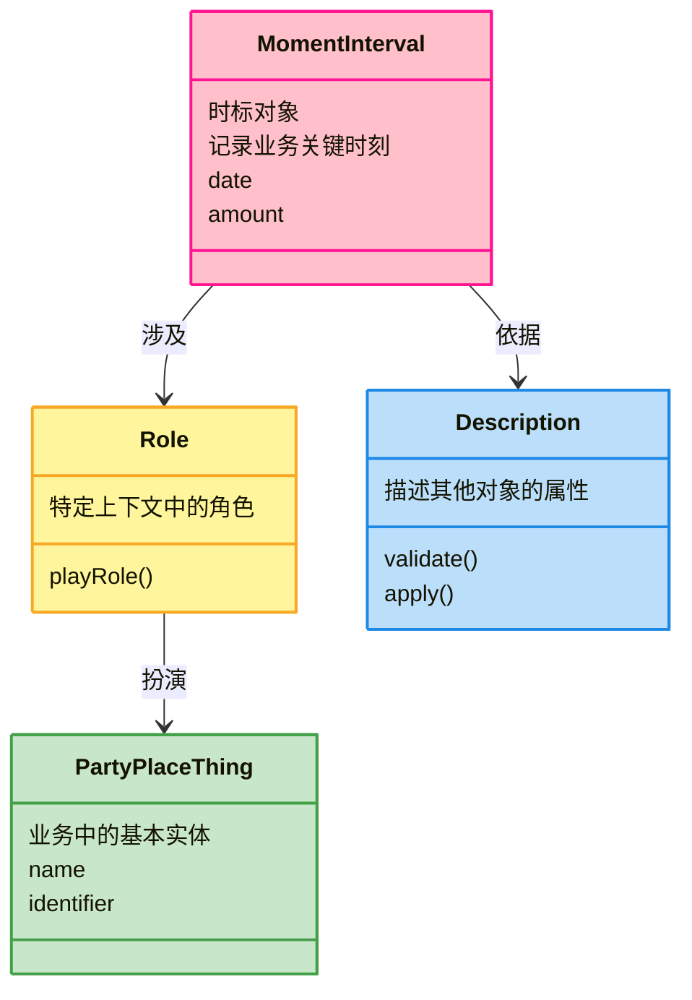
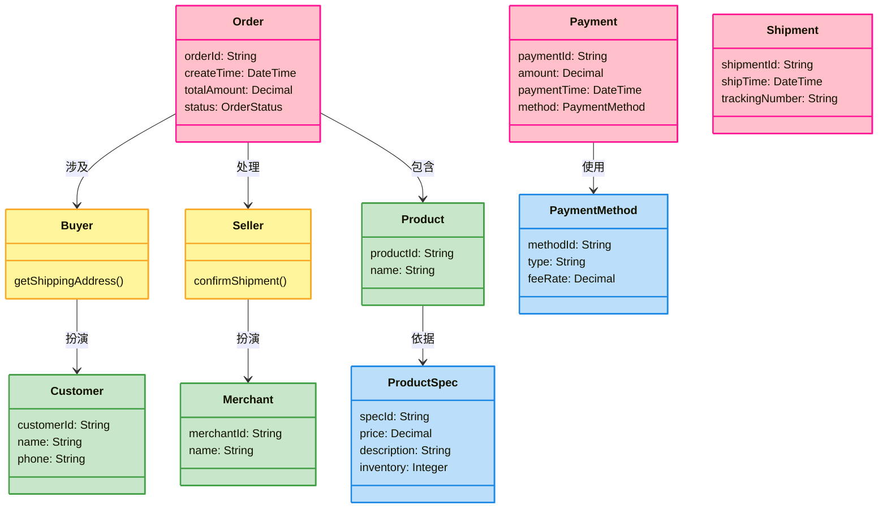

# 四色建模法 - DDD 建模的实用方法论

> 领域驱动设计（DDD）实践中，如何从复杂的业务需求中提炼出清晰、可维护的领域模型，是每个开发者都要面对的挑战。四色建模法（Four Color Modeling）作为一种实用的建模方法论，为我们提供了一套系统化的建模思路。

## 什么是四色建模法

四色建模法（Four Color Modeling）是由 **Peter Coad** 和 **Mark Mayfield** 在 90 年代提出的一种领域建模方法，最初被称为"颜色建模"（Color Modeling）。它通过四种颜色的类来组织领域模型，帮助开发者从业务视角出发，构建出贴近业务本质的模型结构。

> 这个方法在 Peter Coad 的著作 *Java Design: Building Better Apps & Applets* 中得到了系统阐述，后来由 David Anderson 等人进一步完善和推广。

这个方法的核心思想是：**业务模型应该反映业务的真实语义，而不是数据库结构或技术实现细节**。

> **关于颜色**：四种颜色主要用于视觉区分，实际建模时可以使用不同的颜色方案。Peter Coad 原始定义使用粉色（pink）表示 Moment-Interval，但在实际应用中也有使用红色的变体。其他三种颜色（黄、绿、蓝）相对固定。

## 四种颜色的角色

四色建模法将领域对象分为四类，每类用一种颜色表示：



### 粉色 - 时刻-时间段（Moment-Interval）

**粉色类**记录业务中的关键时刻或时间段，是业务事件的"快照"。

> 粉色类通常是系统中最重要的业务对象，它们记录了"什么时间、发生了什么业务事件"。

**特征**：
* 表示一个业务事件或状态变化
* 具有时间属性（创建时间、生效时间等）
* 通常是业务流程的节点

**示例**：
* `Order`（订单）- 订单创建时刻
* `Payment`（支付）- 支付完成时刻
* `Shipment`（发货）- 商品发出时刻
* `Reservation`（预订）- 预订时间段

### 黄色 - 角色（Role）

**黄色类**表示参与者在特定上下文中扮演的角色。

> 一个绿色实体可以在不同场景下扮演不同的黄色角色，这正是角色建模的价值所在。

**特征**：
* 附属于某个绿色实体
* 仅在特定上下文中具有意义
* 一个绿色实体可以同时扮演多个黄色角色

**示例**：
* `Buyer`（买家）- `Customer` 在订单上下文中的角色
* `Seller`（卖家）- `Merchant` 在订单上下文中的角色
* `Approver`（审批人）- `Employee` 在审批流程中的角色
* `Passenger`（乘客）- `Person` 在出行场景中的角色

### 绿色 - 人-地-物（Party-Place-Thing）

**绿色类**表示业务中的基本实体，是业务活动的参与者或资源。

> 绿色类是业务中的"名词"，它们独立于特定业务流程存在，具有持久化的身份标识。

**特征**：
* 具有独立的身份标识
* 跨越多个业务场景存在
* 通常对应现实世界中的实体

**示例**：
* `Person`（人）- 客户、员工等
* `Organization`（组织）- 公司、部门等
* `Product`（产品）- 商品、服务等
* `Location`（地点）- 仓库、门店等

### 蓝色 - 描述（Description）

**蓝色类**描述其他对象的属性或规格信息，实现描述的重用。

> 当多个对象具有相同的属性结构，或属性本身具有业务含义时，应该使用蓝色类来描述。

**特征**：
* 描述绿色或粉色类的属性
* 可以被多个对象共享引用
* 属性本身具有业务价值

**示例**：
* `ProductSpecification`（产品规格）- 描述产品的标准属性
* `PricingRule`（定价规则）- 描述价格计算规则
* `DeliveryTemplate`（配送模板）- 描述配送方式
* `DiscountPolicy`（优惠策略）- 描述折扣规则

## 建模实践步骤

四色建模法的建模过程是一个从业务需求出发，逐步抽象的过程：

### Step 1: 寻找粉色类（时刻-时间段）

首先识别业务中的关键业务事件和状态变化：

> "订单创建后，客户支付了款项，商家发货，客户确认收货"

从这段描述中，我们可以识别出：
* `Order` - 订单创建时刻
* `Payment` - 支付时刻
* `Shipment` - 发货时刻
* `Receipt` - 收货时刻

### Step 2: 寻找绿色类（人-地-物）

识别参与业务活动的基本实体：

* `Customer`（客户）
* `Merchant`（商家）
* `Product`（商品）
* `Warehouse`（仓库）

### Step 3: 寻找黄色类（角色）

分析绿色实体在特定上下文中的角色：

* `Buyer` - `Customer` 在订单中的角色
* `Seller` - `Merchant` 在订单中的角色
* `Shipper` - `Merchant` 在发货中的角色

### Step 4: 寻找蓝色类（描述）

识别可复用的描述信息：

* `ProductSpec` - 产品规格描述
* `PaymentMethod` - 支付方式描述
* `ShippingMethod` - 配送方式描述

## 完整建模示例

以电商订单系统为例，完整的四色建模如下：



## 代码实现

按照四色建模的结果，我们可以用代码表达这个模型：

```java
// * 粉色类 - 时刻-时间段
@Getter
public class Order {
    private final OrderId orderId;
    private final LocalDateTime createTime;
    private Money totalAmount;
    private OrderStatus status;

    // 关联关系 - 买家角色
    private final Buyer buyer;

    // 关联关系 - 卖家角色
    private final Seller seller;

    public Order(OrderId orderId, Buyer buyer, Seller seller) {
        this.orderId = orderId;
        this.createTime = LocalDateTime.now();
        this.buyer = buyer;
        this.seller = seller;
        this.status = OrderStatus.PENDING;
    }

    public void completePayment(Payment payment) {
        this.status = OrderStatus.PAID;
        // 通知卖家发货
        this.seller.notifyPaymentCompleted(payment);
    }
}

// * 黄色类 - 角色
public interface Buyer {
    Address getShippingAddress();
}

public interface Seller {
    void notifyPaymentCompleted(Payment payment);
    void ship(Shipment shipment);
}

// * 绿色类 - 人-地-物
@Getter
public class Customer implements Buyer {
    private final CustomerId customerId;
    private String name;
    private String phone;
    private Address defaultAddress;

    @Override
    public Address getShippingAddress() {
        return this.defaultAddress;
    }
}

@Getter
public class Merchant implements Seller {
    private final MerchantId merchantId;
    private String name;

    @Override
    public void notifyPaymentCompleted(Payment payment) {
        // 发送支付完成通知
    }

    @Override
    public void ship(Shipment shipment) {
        // 处理发货逻辑
    }
}

// * 蓝色类 - 描述
@Getter
public class ProductSpec {
    private final SpecId specId;
    private Money price;
    private String description;
    private Integer inventory;

    public boolean isAvailable(Integer quantity) {
        return this.inventory >= quantity;
    }

    public void decreaseInventory(Integer quantity) {
        if (!isAvailable(quantity)) {
            throw new IllegalStateException("库存不足");
        }
        this.inventory -= quantity;
    }
}
```

## 四色建模法的价值

### 1. 清晰的职责分离

四种颜色分别对应不同的建模关注点：
* **粉色** - 业务流程和事件
* **黄色** - 上下文相关的行为
* **绿色** - 持久化的实体
* **蓝色** - 可复用的规格

### 2. 贴近业务语言

模型中的类名和方法名直接使用业务术语，便于与业务专家沟通。

> 开发者可以直接使用"买家下单"、"卖家发货"这样的业务语言来讨论模型，而不需要转换成技术术语。

### 3. 提高模型的可维护性

当业务规则变化时，只需要修改对应颜色的类，不会影响其他部分：
* 业务流程变化 → 修改粉色类
* 权限规则变化 → 修改黄色类
* 组织架构变化 → 修改绿色类
* 规格标准变化 → 修改蓝色类

## 与 DDD 的关系

四色建模法与 DDD 的战略设计有天然的对应关系：

| 四色建模 | DDD 概念 |
|---------|---------|
| 粉色类 | 聚合根、领域事件 |
| 黄色类 | 受限上下文中的角色 |
| 绿色类 | 实体 |
| 蓝色类 | 值对象、规格模式 |

> 徐昊老师在《如何落地业务建模》课程中指出，四色建模法是连接业务需求和代码实现的有效桥梁，特别适合在 DDD 项目的前期建模阶段使用。

## 实践建议

### 建模顺序

建议按照 **粉色 → 绿色 → 黄色 → 蓝色** 的顺序进行建模：

1. 先识别业务事件（粉色）
2. 再找出参与者（绿色）
3. 然后定义角色（黄色）
4. 最后提取描述（蓝色）

### 避免过度建模

> 不是所有的系统都需要完整的四色建模。对于简单的 CRUD 系统，可能只需要绿色和蓝色类；对于流程复杂的业务系统，四色建模的价值才能真正体现。

### 与团队协作

四色建模法的图示简单直观，非常适合用于团队讨论和评审：
* 与产品经理讨论业务流程
* 与业务专家确认领域概念
* 与开发团队达成建模共识

## 总结

四色建模法通过四种颜色的角色，为我们提供了一套系统化的领域建模方法论：

* **粉色类**记录业务关键时刻，是业务事件的载体
* **黄色类**定义上下文角色，解耦实体与特定场景
* **绿色类**表示业务基本实体，跨越场景持久存在
* **蓝色类**封装可复用描述，避免属性冗余

四色建模法的核心价值在于：**让领域模型真正反映业务语义，成为连接业务需求与技术实现的桥梁**。

在实际项目中，我们可以将四色建模法与 DDD 战略设计结合使用，在战术设计阶段作为验证模型合理性的参考标准。下一篇文章将介绍如何将四色建模与 Smart Domain Pattern 结合，构建真正面向对象的领域模型。

## 参考资料

### 书籍与论文
* Peter Coad, Eric Lefebvre, Jeff De Luca - *Java Design: Building Better Apps & Applets* (Yourdon Press, 1999)
* [Object Models: Strategies, Patterns, & Applications](https://www.amazon.com/Object-Models-Strategies-Patterns-Applications/dp/0136305679) - Peter Coad, David North, Mayfield Mark

### 在线资源
* [David Anderson - Four Color Modeling](https://www.agilemodeling.com/essays/fourColorModeling.htm) - Agile Modeling 官方资源
* [Four Color Archetypes](https://www.smartdomain.com/) - Smart Domain 官网
* [GRASP: General Responsibility Assignment Software Patterns](https://en.wikipedia.org/wiki/GRASP_) - 职责分配模式

### 课程与分享
* 徐昊老师 - 《如何落地业务建模》课程
* [四色建模法实战 - 知乎专栏](https://zhuanlan.zhihu.com/) - 多位作者分享的四色建模实战经验
