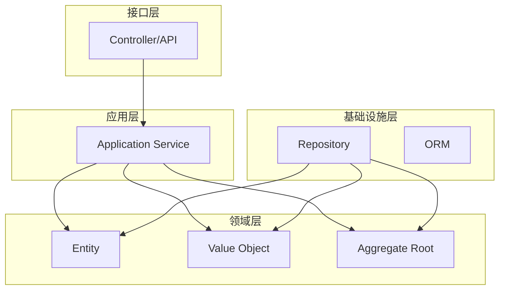
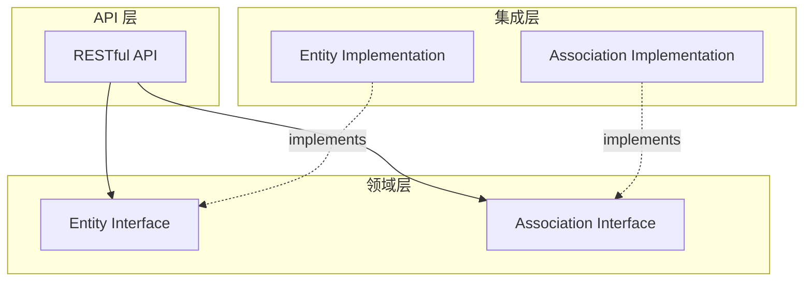
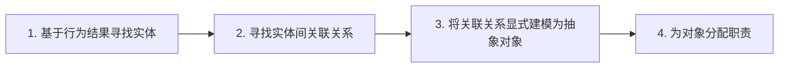
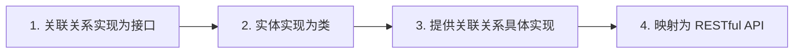
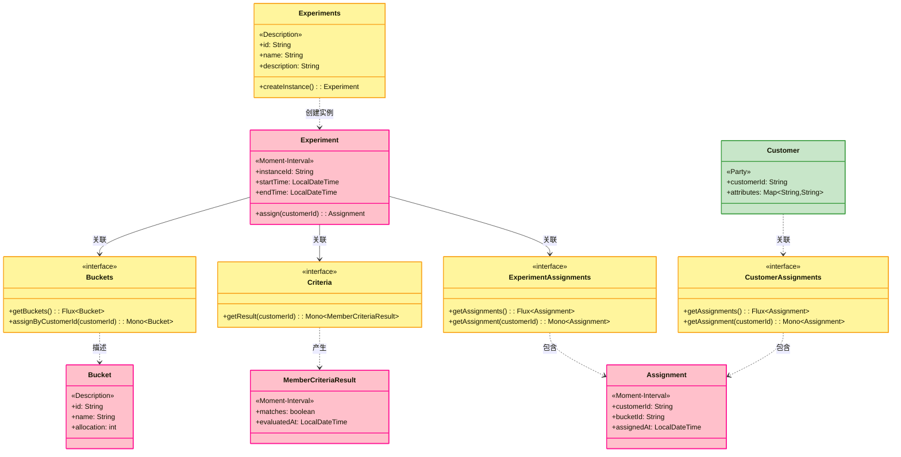

# Smart Domain 架构洞见：回归面向对象的本质

> 本文是关于 Smart Domain 架构模式的深度探讨，分析其如何通过关联关系显式建模来解决传统 DDD 分层架构中的领域模型贫血化问题。

## 前言

在实践领域驱动设计（DDD）的过程中，许多开发者都会遇到一个共同的问题：**领域模型趋于贫血化**。业务逻辑不断从领域层外溢到应用服务层，最终导致领域对象只剩下数据的 getter/setter，而真正的业务规则分散在各个 Service 中。

徐昊老师在《如何使用 Smart Domain 实现 DDD》的分享中，提出了一种回归面向对象本质的架构模式——**Smart Domain**。本文将深入探讨这种架构模式的核心思想、建模方法，以及它与传统分层架构、整洁架构等模式的关系。

## 传统 DDD 分层架构的困境

### 经典四层架构

DDD 的经典四层架构如下：




### 实践中的常见问题

徐昊老师指出，实践 DDD 中存在一个核心假设：**边界中的实体（聚合根和实体）具有相同的生命周期**。这个假设在现实系统中往往不成立：

> 数据库访问、远程服务调用、缓存查询等操作，导致实体间的生命周期无法保持同步。

为了屏蔽这种不同步，我们不得不引入 `Service`、`Repository` 等技术组件：

```java
// 贫血模型的典型表现
public class Order {
    private Long id;
    private BigDecimal amount;
    private String status;
    // 只有 getter/setter，没有业务逻辑
}

// 业务逻辑外溢到 Service
public class OrderService {
    @Autowired
    private OrderRepository orderRepository;
    @Autowired
    private CustomerRepository customerRepository;
    @Autowired
    private InventoryService inventoryService;

    public void cancelOrder(Long orderId) {
        Order order = orderRepository.findById(orderId);
        Customer customer = customerRepository.findById(order.getCustomerId());
        // ...业务逻辑分散在各处
    }
}
```

**这种做法带来的问题：**

- 业务逻辑从领域模型外溢到技术组件
- 领域对象失去其应有的行为，变得"贫血"
- 违背了面向对象的封装原则
- 代码难以表达业务规则和不变量

## Smart Domain 的核心理念

### 理想的面向对象模型

Smart Domain 追求的是这样一个理想模型：

- **一组彼此互联的对象**，与领域概念一一对应
- **适当的抽象**，封装生命周期和实现细节
- **持久化也是实现细节**，应当被封装

### 以数据抽象行为

面向对象的一个核心设计思想是：**以数据抽象行为**。

- 对象是行为产生的结果
- 数据可以表示某个行为
- 关联关系本身就是一种抽象机制

### 实体的三个核心要素

实体由三部分构成：


| 要素                     | 说明       | RESTful 映射 |
| ---------------------- | -------- | ---------- |
| **Identity (身份)**      | 唯一标识     | URI        |
| **Value (值)**          | 属性数据     | Content    |
| **Association (关联关系)** | 与其他对象的关系 | Links      |


### 关联关系的双重抽象

关联关系作为一种抽象机制，提供了两种层次的封装：

**1. 对生命周期的抽象**

- 不需要间接获取的内容 → 同生命周期
- 需要间接调用获取的内容 → 不同生命周期

**2. 对行为的抽象**

- 数据是行为产生的结果
- 通过关联关系获取的对象结果表征某一行为

## Smart Domain 架构模式

### 核心特点

Smart Domain Pattern 具有以下特点：

- **纯面向对象** - 不引入 Service 等技术组件
- **对象图模型** - 模型被建模成对象连接的对象图
- **直接映射** - 模型图可直接映射成 RESTful API
- **屏蔽实现** - 领域层屏蔽实现细节
- **一致性** - 概念模型、实现模型和 API 一致映射

### 分层结构

Smart Domain 将架构简化为两个大层和一个亚层：




- **领域层** - 定义实体和实体间关联关系抽象接口
- **集成层** - 提供关联关系接口实现
- **API 层** - 暴露基于领域对象关系图的 RESTful API

### 默认间接异步获取

考虑到对象可能是通过数据库或远程调用加载，关联关系中方法获取数据应**默认是间接且异步获取的**。

这一点与 **Reactor** 中的 `Mono` 和 `Flux` 概念非常契合：

```java
// 关联关系的异步访问
public interface ExperimentAssociations {
    Mono<MemberCriteriaResult> getCriteriaResult(String customerId);
    Flux<Bucket> getBuckets();
}
```

## Smart Domain 建模步骤

### 建模四步法




#### 步骤 1：基于行为结果寻找实体

从"对象是行为的结果"出发，识别领域实体：

- 识别行为的产出物
- 确定实体的身份标识
- 定义实体的值属性

#### 步骤 2：寻找实体间关联关系

分析实体之间的关系类型：

- 一对一关系
- 一对多关系
- 多对多关系
- 依赖关系

#### 步骤 3：显式建模关联关系

将关联关系建模为独立的抽象对象：

- 定义关联接口
- 明确关联的获取方式
- 设计异步访问机制

#### 步骤 4：为对象分配职责

按照 **[GRASP](https://en.wikipedia.org/wiki/GRASP_)** 信息专家模式：

> 职责应该分配给拥有实现职责所需要的所有信息的对象。

### 实现步骤




## 实践案例：AB 测试服务领域模型

### 识别实体

基于 Smart Domain 建模方法，识别出以下实体：

- **Experiment（实验）** - 作为聚合根聚合实验相关逻辑
- **Bucket（分组）** - 每个实验包含多个实验分组
- **MemberCriteriaCondition（人群圈定条件）** - 用户进入实验判定条件
- **MemberCriteriaResult（人群圈定结果）** - 依据条件得到的结果
- **Assignment（分组结果）** - 每个用户在每个实验中的分组结果

### 领域模型图（四色建模）


| 颜色     | 类型                | 说明              | 对应对象                                            |
| ------ | ----------------- | --------------- | ------------------------------------------------ |
| 🩷 粉色  | Moment-Interval   | 时刻/时间段：事件、活动、交易 | Experiment, Assignment, MemberCriteriaResult, Bucket |
| 🟨 黄色  | Role              | 角色/关联/集合：上下文中的关系 | **Experiments**, Buckets, Criteria, CustomerAssignments, ExperimentAssignments |
| 🔵 蓝色  | Description       | 描述：规则、模式、类型     | -                                               |
| 🟩 绿色  | Party/Place/Thing | 人/地点/物品：具体实体    | Customer                                          |





### 职责分配示例

**计算分组职责的分配：**

- 需要：圈人条件、圈人结果、实验分组
- 拥有全部信息的对象：**Experiment**
- 实现：`Experiment.assign()` 方法
- 委托：随机分配委托给关联关系对象 `Buckets.assignByCustomerId()`

```java
public class Experiment {
    private final String id;
    private final Buckets buckets;
    private final Criteria criteria;

    public Assignment assign(String customerId) {
        return criteria.getResult(customerId)
            .filter(MemberCriteriaResult::matches)
            .flatMap(result -> buckets.assignByCustomerId(customerId))
            .map(bucket -> new Assignment(customerId, bucket.getId()))
            .block();
    }
}
```

## 与其他架构模式的对比

### 架构模式对比表


| 架构类型             | 核心理念     | 依赖方向                       | 关联关系处理                     |
| ---------------- | -------- | -------------------------- | -------------------------- |
| **传统四层架构**       | 功能职责分离   | UI → App → Domain ← Infra  | 隐式处理，依赖 Service/Repository |
| **六边形架构**        | 端口与适配器   | Core 不依赖外部                 | 通过端口接口隔离                   |
| **整洁架构**         | 依赖倒置     | 外层依赖内层                     | 通过接口抽象                     |
| **Smart Domain** | 关联关系显式建模 | API → Domain ← Integration | **显式建模为抽象对象**              |


### 贫血模型 vs 充血模型


| 对比维度         | 贫血模型        | 充血模型 (Smart Domain) |
| ------------ | ----------- | ------------------- |
| **业务逻辑位置**   | Service 层   | 领域对象                |
| **对象职责**     | 仅承载数据       | 数据 + 行为             |
| **可测试性**     | 需 mock 大量依赖 | 专注业务逻辑              |
| **符合 OO 原则** | ❌ 违背封装      | ✅ 符合封装              |


## 总结

Smart Domain 架构模式提供了一种回归面向对象本质的 DDD 实践方法：

- **将关联关系显式建模为抽象对象**，不再隐式处理
- **默认间接异步获取**，统一数据库和远程调用带来的生命周期差异
- **合理分配职责**给对象（包括关联关系），无需引入 Service 等额外技术组件
- **分层简单清晰**，真正实现模型与实现的一致性

> Martin Fowler 曾将贫血模型称为反模式，因为它违背了面向对象的核心原则。Smart Domain 通过显式建模关联关系，让业务逻辑回归领域对象，使代码更具表达力和可维护性。

## 参考资料

- [徐昊老师分享 - 如何使用Smart Domain实现DDD](https://www.bilibili.com/video/BV1QT411J7jh)
- [Re-engineering-Domain-Driven-Design/Accounting](https://github.com/Re-engineering-Domain-Driven-Design/Accounting)
- [AB测试服务实践代码 - GitHub](https://github.com/pc-dong/ab-testing)
- [GRASP 设计模式](https://en.wikipedia.org/wiki/GRASP_)
- [Reactor - Mono 和 Flux 区别](https://dimitr.im/difference-between-mono-and-flux)

---

> 本篇文章深入探讨了 Smart Domain 架构模式的核心理念和实践方法。相关代码见 [GitHub - Re-engineering-Domain-Driven-Design/Accounting](https://github.com/Re-engineering-Domain-Driven-Design/Accounting) 和 [GitHub - pc-dong/ab-testing](https://github.com/pc-dong/ab-testing)。

