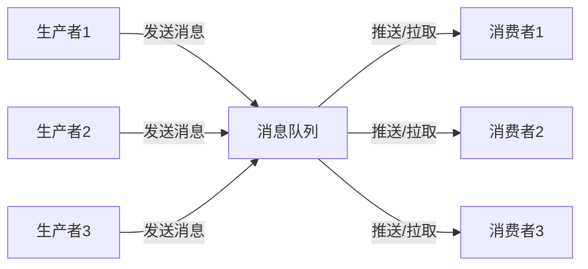
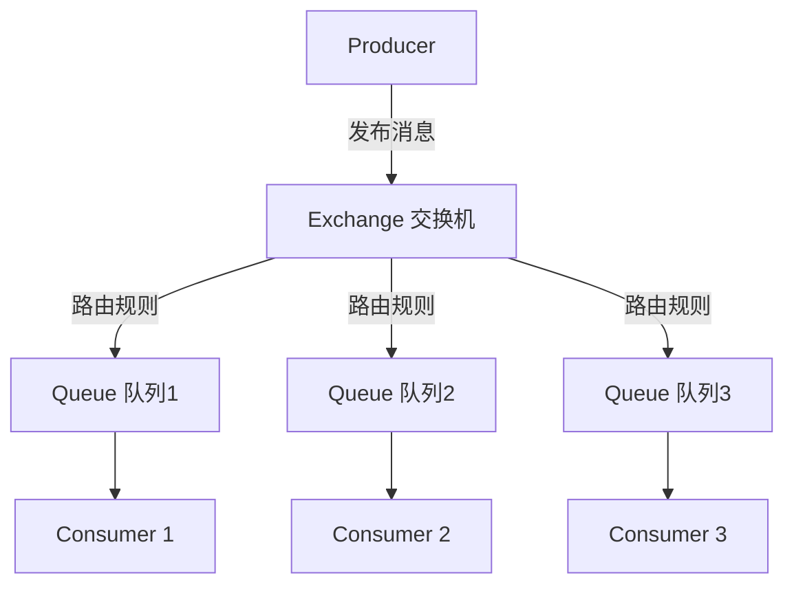
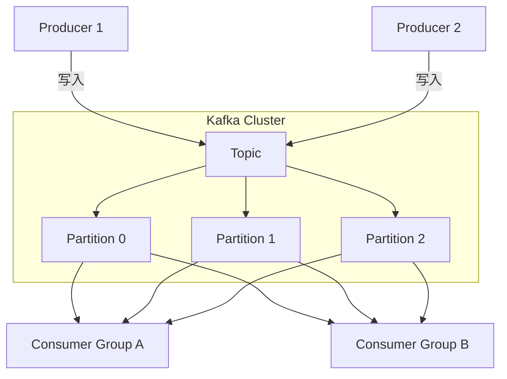
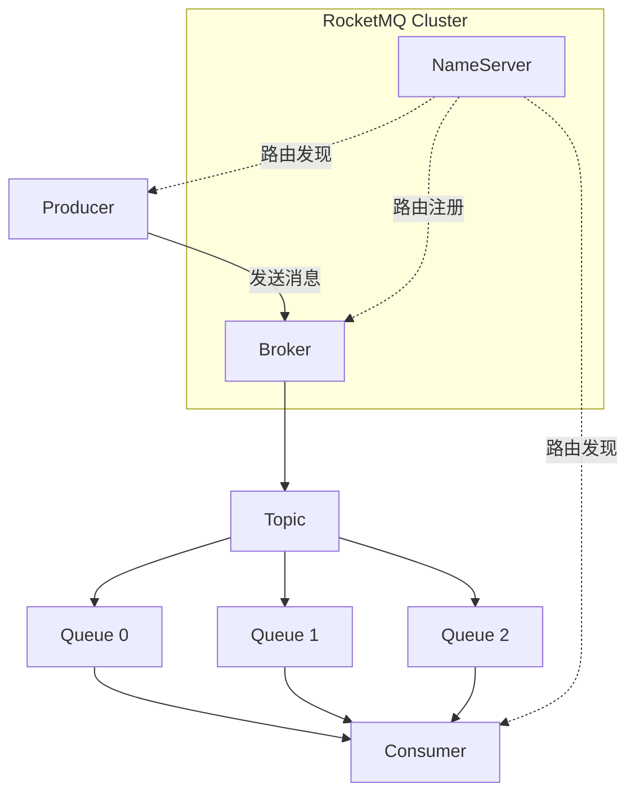
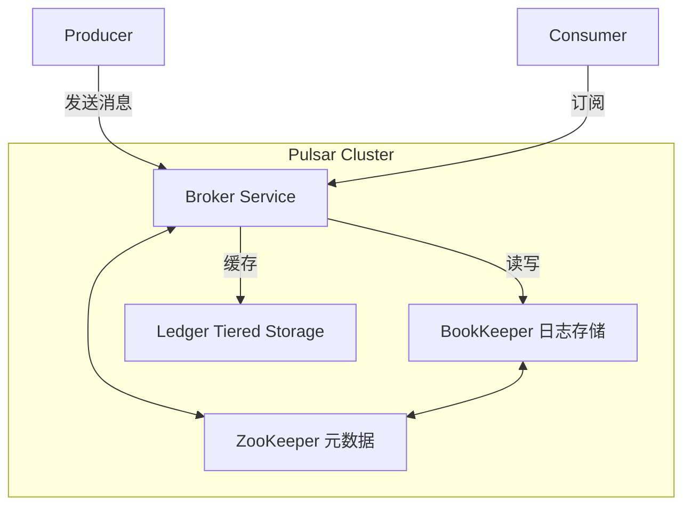
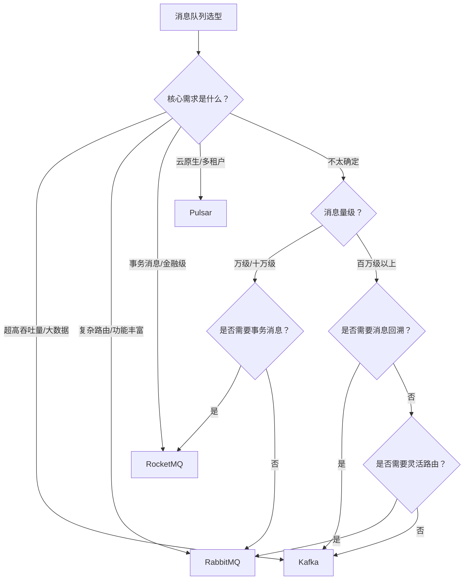

# 主流消息队列对比 - RabbitMQ、Kafka、RocketMQ、Pulsar

> 消息队列（Message Queue，简称 MQ）是分布式系统中不可或缺的基础组件，广泛应用于异步通信、流量削峰、系统解耦等场景。面对 RabbitMQ、Kafka、RocketMQ、Pulsar 等众多选择，如何根据业务场景做出合适的技术选型？本文将从架构设计、核心特性、性能表现等维度进行系统对比。

## 什么是消息队列

消息队列是一种**进程间通信或同一进程不同线程间通信**的方式，核心思想是：**消息的发送者和接收者不需要同时在线**。发送者将消息放入队列，接收者在需要时从队列中取出消息进行处理。

### 消息队列的核心作用

* **系统解耦**：上游系统只需将消息投递到队列，无需关心下游系统的处理逻辑和可用性
* **异步处理**：将非实时要求的操作异步化，提升接口响应速度
* **流量削峰**：在瞬时高并发场景下缓冲请求，保护下游系统不被压垮
* **最终一致性**：通过消息的可靠投递实现分布式事务的最终一致性

> 在微服务架构中，消息队列几乎是标配组件。但不同的 MQ 产品在架构设计、性能特性、使用场景上差异很大，选型时需要结合业务需求仔细评估。

## 四大主流消息队列概览

| 特性 | RabbitMQ | Kafka | RocketMQ | Pulsar |
|------|----------|-------|----------|--------|
| **开发语言** | Erlang | Scala + Java | Java | Java |
| **初始发布** | 2007 | 2011（LinkedIn） | 2012（阿里巴巴） | 2015（Yahoo） |
| **协议支持** | AMQP、STOMP、MQTT | 自定义协议 | 自定义协议 | 自定义协议 |
| **定位** | 通用消息代理 | 分布式流平台 | 分布式消息中间件 | 云原生消息平台 |
| **开源协议** | MPL 2.0 | Apache 2.0 | Apache 2.0 | Apache 2.0 |

## RabbitMQ

RabbitMQ 是最早被广泛使用的消息队列之一，基于 **Erlang** 语言开发，原生实现了 **AMQP**（Advanced Message Queuing Protocol）协议。

### 架构设计

RabbitMQ 的核心概念：

* **Exchange（交换机）**：接收生产者发送的消息，根据路由规则将消息路由到一个或多个队列
* **Queue（队列）**：存储消息，等待消费者消费
* **Binding（绑定）**：定义 Exchange 和 Queue 之间的关系及路由规则
* **Channel（通道）**：在单个 TCP 连接上复用的轻量级通信通道

### Exchange 类型

RabbitMQ 提供了四种 Exchange 类型，对应不同的路由策略：

| Exchange 类型 | 路由规则 | 适用场景 |
|--------------|---------|---------|
| **Direct** | 精确匹配 routing key | 点对点通信 |
| **Fanout** | 广播到所有绑定队列 | 广播通知 |
| **Topic** | 通配符匹配 routing key | 发布/订阅模式 |
| **Headers** | 匹配消息头属性 | 特殊路由需求 |

### 核心优势

* **功能丰富**：支持优先级队列、延迟队列、死信队列、消息确认、消息追踪等丰富特性
* **协议标准**：原生实现 AMQP 协议，跨语言支持好，客户端库覆盖几乎所有主流语言
* **管理界面**：提供开箱即用的 Web 管理界面，方便运维监控
* **灵活路由**：Exchange 机制提供强大的消息路由能力

### 局限性

* **吞吐量有限**：单机吞吐量在万级（消息/秒），不适合超大规模数据流场景
* **Erlang 门槛**：底层使用 Erlang 语言，二次开发和问题排查的学习成本较高
* **集群扩展**：集群扩展能力有限，队列通常只存在于单个节点上
* **消息积压**：大量消息积压时性能下降明显

> RabbitMQ 非常适合中小规模的业务系统，尤其是需要复杂路由规则和消息确认机制的场景。

## Kafka

Apache Kafka 最初由 **LinkedIn** 开发，定位为**分布式流处理平台**。与传统消息队列不同，Kafka 的核心设计理念是**以日志为中心**的高吞吐量消息存储。

### 架构设计

Kafka 的核心概念：

* **Topic（主题）**：消息的逻辑分类，类似于数据库中的表
* **Partition（分区）**：Topic 的物理分片，是并行度的基本单位
* **Consumer Group（消费者组）**：一组消费者共同消费一个 Topic，每个分区只被组内一个消费者消费
* **Broker**：Kafka 集群中的单个服务节点
* **ZooKeeper / KRaft**：集群元数据管理（新版 Kafka 已内置 KRaft 替代 ZooKeeper）

### 核心优势

* **超高吞吐量**：单机可达百万级消息/秒，是所有 MQ 中吞吐量最高的
* **持久化能力强**：消息写入磁盘日志，支持消息回溯和长时间存储
* **水平扩展**：通过增加 Partition 和 Broker 实现线性扩展
* **生态完善**：与大数据组件（Spark、Flink、Hadoop）深度集成
* **消息顺序性**：在单个 Partition 内保证消息的严格顺序

### 局限性

* **功能相对简单**：不支持优先级队列、延迟队列等高级特性
* **无完善的路由机制**：不支持像 RabbitMQ 那样灵活的消息路由
* **消息模型单一**：主要是发布/订阅模型，点对点场景需要借助 Consumer Group 模拟
* **运维复杂度**：集群管理（尤其是 ZooKeeper/KRaft 配置）需要较多运维经验

> Kafka 是大数据场景的绝对主力，在日志收集、实时数据管道、流处理等场景中几乎是默认选择。

## RocketMQ

Apache RocketMQ 是**阿里巴巴**开源的分布式消息中间件，经历了多次"双11"的考验，在金融级可靠消息场景中表现出色。

### 架构设计

RocketMQ 的核心概念：

* **NameServer**：轻量级注册中心，管理 Broker 的路由信息（无状态，部署简单）
* **Broker**：消息存储和转发的核心节点，分为 Master 和 Slave
* **Producer Group / Consumer Group**：生产者和消费者的逻辑分组

### 核心优势

* **事务消息**：原生支持分布式事务消息，保证本地事务与消息发送的原子性
* **高可靠性**：支持同步刷盘、同步双写，消息丢失概率极低
* **延迟消息**：原生支持延迟消息（开源版支持特定延迟级别）
* **消息过滤**：支持 Tag 过滤和 SQL 表达式过滤
* **消息回溯**：支持按时间戳回溯消息
* **亿级消息积压**：在消息大量积压场景下依然保持稳定

### 局限性

* **社区活跃度**：相比 Kafka，国际社区活跃度较低（但国内社区非常活跃）
* **客户端语言**：Java 客户端最成熟，其他语言客户端相对较弱
* **管理界面**：开源版管理工具功能较为基础
* **不支持 AMQP**：使用自定义协议，迁移成本较高

> RocketMQ 在国内金融、电商领域应用广泛，特别是在需要事务消息和严格消息顺序的场景中优势明显。

## Pulsar

Apache Pulsar 最初由 **Yahoo** 开发，定位为**云原生消息平台**。其最显著的特点是**计算与存储分离**的架构设计。

### 架构设计

Pulsar 的核心概念：

* **Broker**：无状态的计算层，负责消息的接收和投递
* **BookKeeper**：分布式日志存储层，负责消息的持久化
* **Ledger**：BookKeeper 中的写入单元
* **Topic**：逻辑消息通道
* **Subscription**：灵活的订阅模式

### 订阅模式

Pulsar 支持四种订阅模式，是所有 MQ 中最灵活的：

| 订阅模式 | 说明 | 类比 |
|---------|------|------|
| **Exclusive** | 单个消费者独占订阅 | 类似点对点 |
| **Failover** | 主备模式，主消费者故障时备消费者接管 | 高可用点对点 |
| **Shared** | 多个消费者共享消费，轮询分配消息 | 负载均衡消费 |
| **Key_Shared** | 按消息 Key 哈希分配给消费者，保证同 Key 消息有序 | 有序共享消费 |

### 核心优势

* **存算分离**：Broker 无状态，可以独立扩展计算层和存储层
* **多租户**：原生支持多租户隔离，适合 SaaS 平台
* **分层存储**：支持将冷数据自动迁移到低成本存储（S3、HDFS）
* **多种订阅模式**：四种订阅模式灵活切换
* **Geo 复制**：原生支持跨机房复制
* **兼容性好**：提供 Kafka 和 RabbitMQ 兼容层（KoP / AoP），降低迁移成本

### 局限性

* **运维复杂度高**：依赖 ZooKeeper 和 BookKeeper，组件较多
* **生态不够成熟**：相比 Kafka，大数据生态集成较少
* **学习曲线**：概念较多，上手门槛高于其他 MQ
* **社区规模**：社区规模和成熟度不如 Kafka 和 RabbitMQ

> Pulsar 适合云原生架构和需要多租户、跨地域复制的场景，是微服务架构中的有力竞争者。

## 核心维度对比

### 性能对比

| 指标 | RabbitMQ | Kafka | RocketMQ | Pulsar |
|------|----------|-------|----------|--------|
| **单机吞吐量** | 万级 | 百万级 | 十万级 | 百万级 |
| **延迟** | 微秒级 | 毫秒级 | 毫秒级 | 毫秒级 |
| **消息可靠性** | 高 | 高 | 非常高 | 高 |
| **消息积压能力** | 一般 | 非常强 | 非常强 | 非常强 |

> 性能数据受硬件配置、消息大小、持久化策略等因素影响，以上数据为典型场景下的量级参考。

### 功能特性对比

| 特性 | RabbitMQ | Kafka | RocketMQ | Pulsar |
|------|----------|-------|----------|--------|
| **事务消息** | 不支持 | 支持（Exactly-Once） | 支持（半消息模式） | 支持 |
| **延迟消息** | 通过插件支持 | 不支持 | 原生支持 | 原生支持 |
| **消息顺序** | 单队列有序 | 单分区有序 | 单队列有序 | 单分区有序 |
| **消息过滤** | 不支持 | 不支持 | Tag + SQL 过滤 | SQL 过滤 |
| **消息回溯** | 不支持 | 支持按 Offset/时间戳 | 支持按时间戳 | 支持按时间戳 |
| **死信队列** | 原生支持 | 不支持 | 原生支持 | 原生支持 |
| **优先级队列** | 支持 | 不支持 | 不支持 | 不支持 |
| **消息轨迹** | 通过插件支持 | 不支持 | 原生支持 | 原生支持 |

### 运维与生态对比

| 维度 | RabbitMQ | Kafka | RocketMQ | Pulsar |
|------|----------|-------|----------|--------|
| **部署复杂度** | 低 | 中 | 中 | 高 |
| **管理界面** | 优秀 | 一般（第三方） | 基础 | 一般 |
| **客户端语言** | 全面 | 全面 | Java 为主 | 全面 |
| **大数据集成** | 一般 | 优秀 | 一般 | 良好 |
| **国内社区** | 活跃 | 非常活跃 | 非常活跃 | 活跃 |
| **国际社区** | 非常活跃 | 非常活跃 | 活跃 | 活跃 |

## 选型建议

### 场景推荐

**选择 RabbitMQ 的场景**：
* 中小规模业务系统，消息量在万级
* 需要灵活的消息路由规则（如基于 routing key 的复杂路由）
* 团队偏好简单易用的管理界面和运维体验
* 需要支持多种消息协议（AMQP、MQTT、STOMP）
* 异步任务处理、RPC 通信、通知推送等通用场景

**选择 Kafka 的场景**：
* 大数据处理管道，日志收集和分析
* 实时流处理（配合 Flink / Spark Streaming）
* 消息量级在百万级以上
* 需要长时间存储消息，支持消息回溯
* 事件溯源（Event Sourcing）架构

**选择 RocketMQ 的场景**：
* 金融、电商等对消息可靠性要求极高的场景
* 需要分布式事务消息保证
* 需要延迟消息、定时消息
* 国内团队，中文社区支持好
* 订单处理、支付通知、库存扣减等业务场景

**选择 Pulsar 的场景**：
* 云原生架构，需要存算分离
* SaaS 平台，需要多租户隔离
* 跨地域部署，需要 Geo 复制
* 需要从 Kafka 或 RabbitMQ 平滑迁移
* 分层存储需求，冷热数据分离

## 总结

本文从架构设计、性能表现、功能特性和运维生态等维度，对比了 RabbitMQ、Kafka、RocketMQ、Pulsar 四大主流消息队列。

没有"最好"的消息队列，只有"最合适"的：

* **RabbitMQ** — 功能最丰富，中小规模通用场景的首选
* **Kafka** — 吞吐量之王，大数据和流处理领域的标准
* **RocketMQ** — 金融级可靠，国内业务场景的优选
* **Pulsar** — 云原生架构，面向未来的消息平台

> 在实际项目中，建议先明确业务场景的核心需求（吞吐量、可靠性、功能特性），再结合团队技术栈和运维能力做出选型。对于复杂系统，不同场景甚至可以混合使用多种 MQ，各取所长。

相关代码和示例见 [GitHub - pc-dong](https://github.com/pc-dong)。
